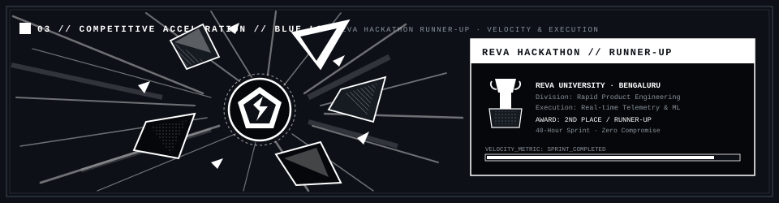
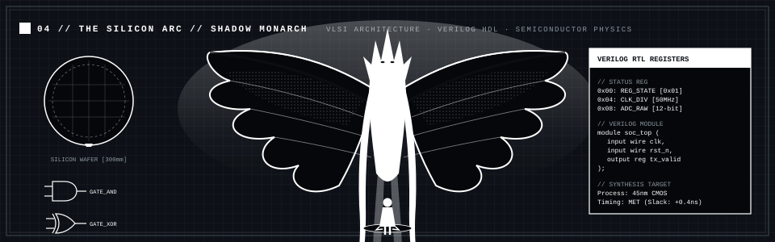

<div align="center">


# V S KIRAN

<sub>ELECTRONICS &amp; INSTRUMENTATION UNDERGRADUATE · BANGALORE INSTITUTE OF TECHNOLOGY</sub>

```text
software  ·  circuits & signals  ·  machine learning  ·  vlsi
still figuring things out.
```

[](https://www.linkedin.com/in/vs-kiran-16b178394/)
[](https://github.com/Kiran8112006)

</div>

---

### `01 // ABOUT`

<div align="center">
  
</div>

> *“Late-night compile logs, steady rain against glass, and the quiet pursuit of foundational mastery.”*

I am an Electronics &amp; Instrumentation Engineering undergraduate at **Bangalore Institute of Technology (BIT Bangalore)**, Batch of 2024–2028, maintaining a **CGPA of 9.14 through Semester 4**.

My work sits at the intersection of embedded telemetry, physical sensor dynamics, and scalable software pipelines. Whether decomposing continuous accelerometer waveforms into discrete collision events or modeling abnormal transients across electrical distribution lines, I engineer systems designed to operate under real-world physical constraints.

```text
INSTITUTION     │  Bangalore Institute of Technology (BIT)
DISCIPLINE      │  Electronics & Instrumentation Engineering (2024 – 2028)
METRICS         │  CGPA: 9.14 (through Semester 4)
CURRENT FOCUS   │  Hardware Telemetry · Real-Time Detection Pipelines · VLSI Design
```

---

### `02 // FIELD LOGS & RECONNAISSANCE`

<div align="center">
  
</div>

#### `01` RoadSOS
> **Mobile sensing → Telemetry stream → Motion anomalies → Emergency dispatch**

A sensor-driven collision detection system built to evaluate real-time motion anomalies. It monitors background accelerometer and gyroscope streams from mobile telemetry, applies ML-based pattern identification, and dispatches location and alerts through backend services during dangerous events.

- **Stack:** Python, JavaScript, Node.js, C++
- **Telemetry:** Continuous 3-axis IMU logging, dynamic threshold triggers, GPS coordinate telemetry
- **Status:** `Active build / Ongoing refinement`

---

#### `02` GridSenti
> **Electrical telemetry → High-impedance fault identification**

An exploratory detection pipeline targeting abnormal conditions in electrical distribution networks. It pairs continuous telemetry data with rule-based heuristics and ML fault classification to catch high-impedance faults that slip past conventional threshold switches.

- **Stack:** Python, C, C++
- **Focus:** Transient analysis, waveform feature extraction, electrical safety modeling
- **Status:** `Exploratory analysis & modeling`

---

#### `03` HireLoop
> **Campus recruitment pipeline engine**

A unified coordination platform engineered for students, recruiters, and placement coordinators. Built to replace fragmented spreadsheets and manual audit logs with a high-throughput, deterministic workflow engine.

- **Candidates:** Resume build, project logs, lifecycle application tracking.
- **Recruiters:** Candidate evaluation, drive management, interview scheduling.
- **Placement Cell:** Central pipeline visibility, workflow notifications, audit trail integrity.
- **Stack:** React, Next.js, JavaScript, HTML, CSS, Node.js, Git, GitHub
- **Status:** `Active deployment & evaluation`

---

### `03 // COMPETITIVE ACCELERATION`

<div align="center">
  
</div>

```text
EVENT           │  REVA Hackathon
RESULT          │  Runner-Up (2nd Place)
DOMAIN          │  Rapid Product Engineering & Real-time Telemetry
MANDATE         │  High-velocity execution under strict 48-hour time constraint
```

---

### `04 // THE SILICON ARC`

<div align="center">
  
</div>

Moving deeper beneath the software abstraction layer into raw silicon logic, hardware description, and transistor physics.

```text
HARDWARE ARC    │  VLSI Architecture  ·  Verilog HDL  ·  Semiconductor Physics
TARGETS         │  RTL Synthesis  ·  Finite State Machines (FSM)  ·  CMOS Logic
OBJECTIVE       │  Bridging deterministic silicon hardware with modern computation
```

---

### `05 // COGNITIVE ARCHITECTURE & MINDSET`

<div align="center">
  
</div>

> *“In complex systems, noise is abundant. Precision is rare. Observe telemetry, isolate invariants, and execute without hesitation.”*

---

### `06 // TECHNICAL ARSENAL`

```text
LANGUAGES       │  C  ·  C++  ·  Python
WEB & UI        │  HTML  ·  CSS  ·  JavaScript  ·  React  ·  Next.js  ·  Node.js
VERSION CONTROL │  Git  ·  GitHub
```

---

### `07 // CONTINUOUS TELEMETRY`

<div align="center">

<picture>
  <source media="(prefers-color-scheme: dark)" srcset="https://raw.githubusercontent.com/Kiran8112006/Kiran8112006/output/github-contribution-grid-snake-dark.svg" />
  <source media="(prefers-color-scheme: light)" srcset="https://raw.githubusercontent.com/Kiran8112006/Kiran8112006/output/github-snake.svg" />
  
</picture>

<sub>COMMIT FREQUENCY LOGGED VIA GITHUB ACTIONS AUTOMATION</sub>

</div>

---

<div align="center">
<sub>KIRAN8112006 // SYSTEM STABLE // BENGALURU, INDIA</sub>
</div>
