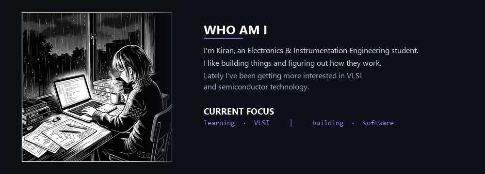
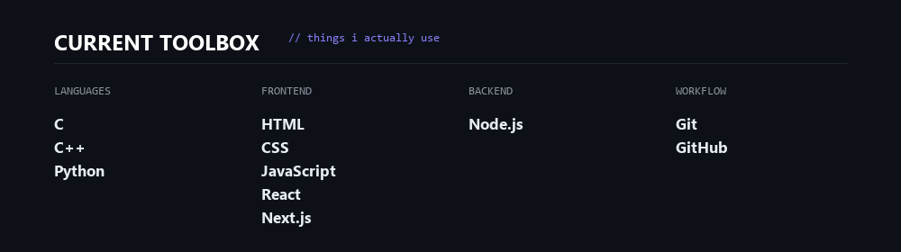
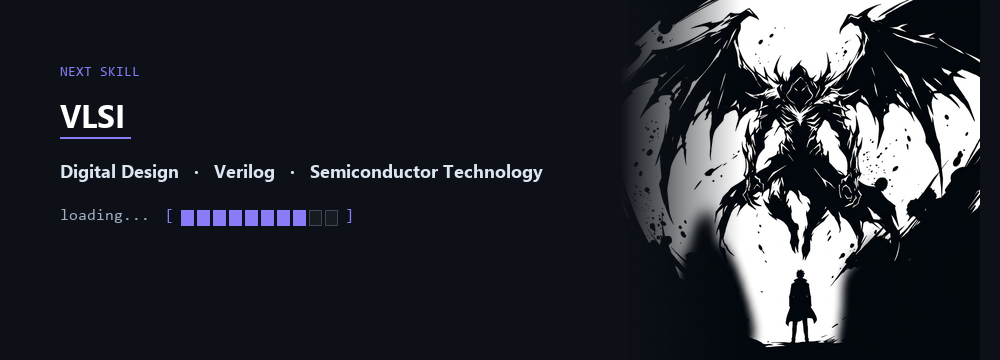
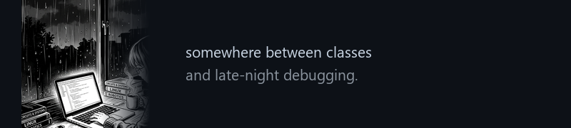
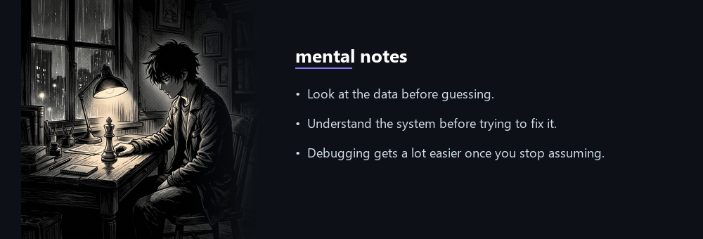
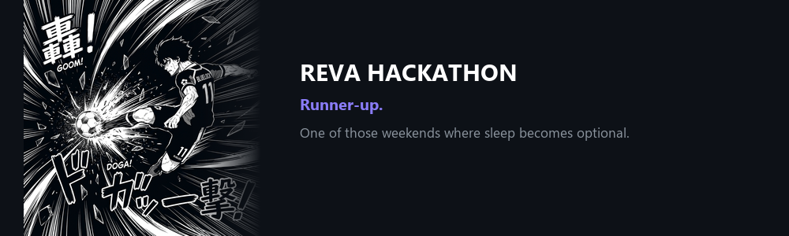

<!-- HERO -->

  

<!-- CONTACT LINKS -->
[LinkedIn](https://www.linkedin.com/in/vs-kiran-16b178394/) &nbsp;·&nbsp; [GitHub](https://github.com/Kiran8112006) &nbsp;·&nbsp; [vskiran53@gmail.com](mailto:vskiran53@gmail.com)

  

<!-- WHO AM I + CURRENT FOCUS -->

  

<!-- TECHNICAL TOOLBOX -->

  

<!-- SOLO LEVELING — NEXT SKILL -->

  

<!-- HORIMIYA — PERSONAL MOMENT -->

  

<!-- COTE × THE MENTALIST — MENTAL NOTES -->

  

<!-- BLUE LOCK — REVA HACKATHON -->

  

<!-- CONTRIBUTION SNAKE -->
activity

  

<picture>
  <source media="(prefers-color-scheme: dark)" srcset="https://raw.githubusercontent.com/Kiran8112006/Kiran8112006/output/github-snake-dark.svg" />
  <source media="(prefers-color-scheme: light)" srcset="https://raw.githubusercontent.com/Kiran8112006/Kiran8112006/output/github-snake.svg" />
  
</picture>

  

still learning. still building.

