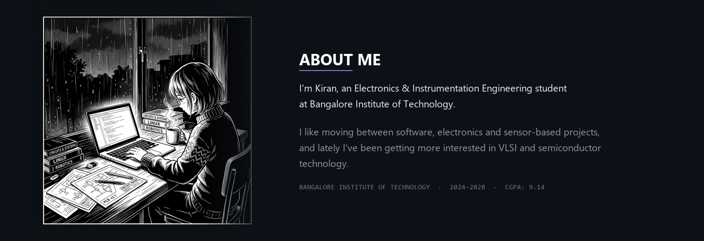
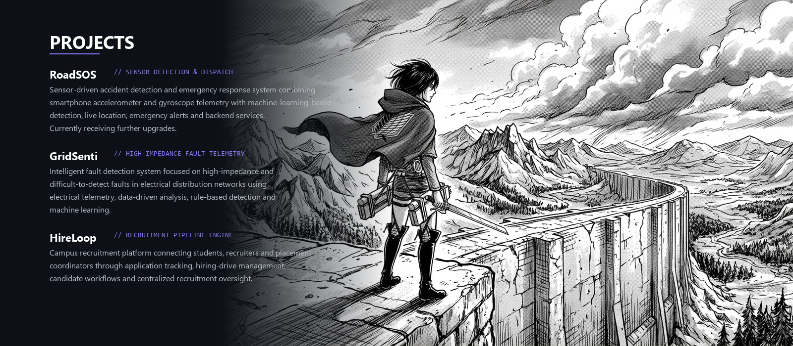
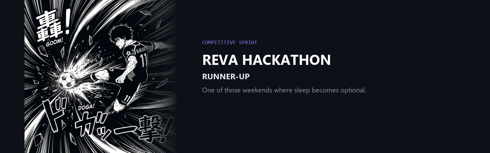
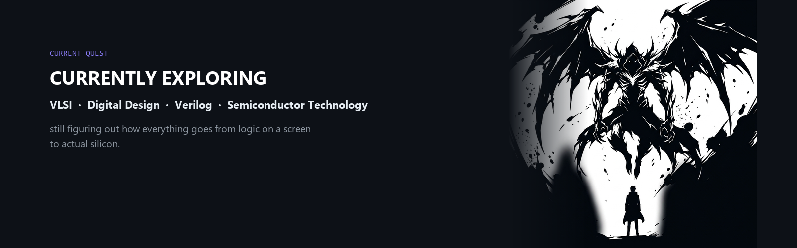
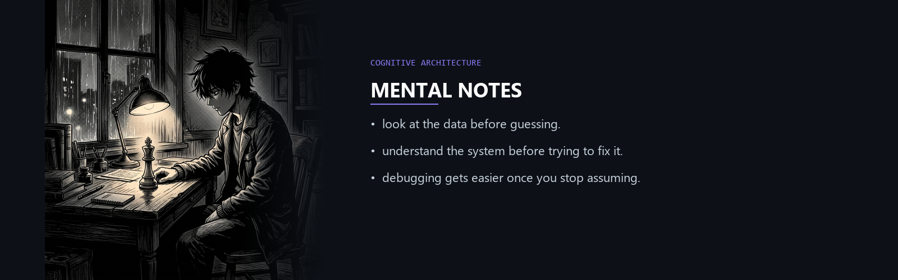

 

[LinkedIn](https://www.linkedin.com/in/vs-kiran-16b178394/) &nbsp;·&nbsp; [GitHub](https://github.com/Kiran8112006) &nbsp;·&nbsp; [vskiran53@gmail.com](mailto:vskiran53@gmail.com)

  

  

  

  

  

  

### things i actually use

`C` &nbsp;·&nbsp; `C++` &nbsp;·&nbsp; `Python` &nbsp;·&nbsp; `HTML` &nbsp;·&nbsp; `CSS` &nbsp;·&nbsp; `JavaScript` &nbsp;·&nbsp; `React` &nbsp;·&nbsp; `Next.js` &nbsp;·&nbsp; `Node.js` &nbsp;·&nbsp; `Git` &nbsp;·&nbsp; `GitHub`

  

### activity

<picture>
  <source media="(prefers-color-scheme: dark)" srcset="https://raw.githubusercontent.com/Kiran8112006/Kiran8112006/output/github-snake-dark.svg" />
  <source media="(prefers-color-scheme: light)" srcset="https://raw.githubusercontent.com/Kiran8112006/Kiran8112006/output/github-snake.svg" />
  
</picture>

  

still learning. still building.

