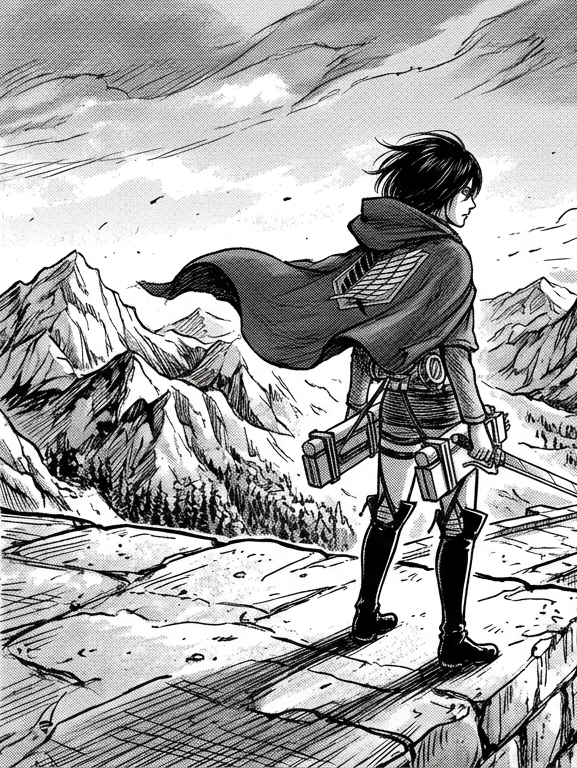
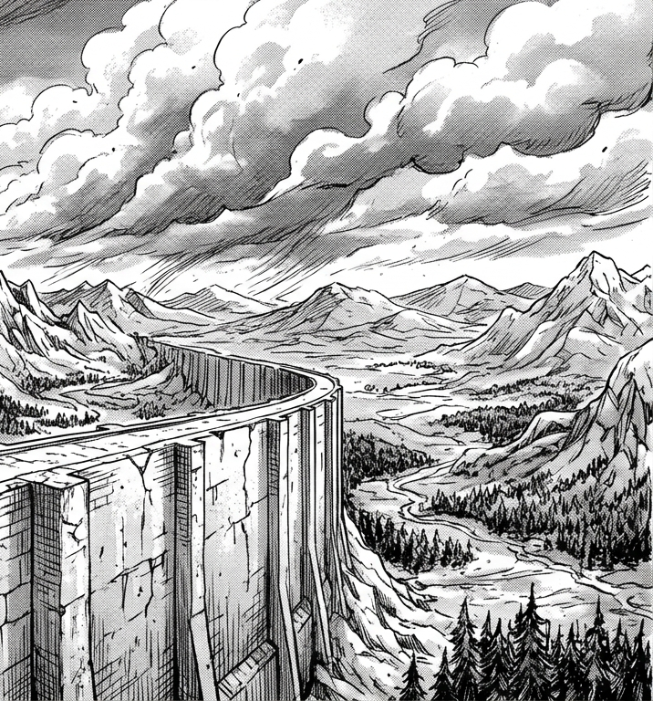

  

# V S KIRAN

### E&amp;I ENGINEERING STUDENT

`software` &nbsp;·&nbsp; `electronics` &nbsp;·&nbsp; `ML` &nbsp;·&nbsp; `VLSI`

*mostly building things and figuring out how they work.*

 

[LinkedIn](https://www.linkedin.com/in/vs-kiran-16b178394/) &nbsp;·&nbsp; [GitHub](https://github.com/Kiran8112006) &nbsp;·&nbsp; [vskiran53@gmail.com](mailto:vskiran53@gmail.com)

 

---

 

<table>
  <tr>
    <td width="42%" align="center" valign="middle">
      
    </td>
    <td width="58%" valign="middle">
      <h3>about me</h3>
      
I'm Kiran, an Electronics &amp; Instrumentation Engineering student at Bangalore Institute of Technology (2024–2028, CGPA: 9.14 through Semester 4).

      
I like moving between software, electronics, and sensor-based projects, and lately I've been getting more interested in VLSI and semiconductor technology.

      
<strong>Coursework:</strong> Digital System Design &amp; Verilog, Analog Circuits, Embedded Controllers, Signal Conditioning &amp; Data Acquisition, Measurement &amp; Transducers.

    </td>
  </tr>
</table>

 

---

 

### projects

<table>
  <tr>
    <td width="42%" align="center" valign="middle">
      
    </td>
    <td width="58%" valign="middle">
      <h3>RoadSOS</h3>
      
A sensor-driven accident detection and emergency response system combining smartphone accelerometer and gyroscope telemetry with machine-learning-based detection, live location, emergency alerts, and backend services. Currently receiving further upgrades.

    </td>
  </tr>
</table>

<table>
  <tr>
    <td width="58%" valign="middle">
      <h3>GridSenti</h3>
      
An intelligent fault detection system focused on high-impedance and difficult-to-detect faults in electrical distribution networks using electrical telemetry, data-driven analysis, rule-based detection, and machine learning.

    </td>
    <td width="42%" align="center" valign="middle">
      
    </td>
  </tr>
</table>

<table>
  <tr>
    <td width="42%" align="center" valign="middle">
      
    </td>
    <td width="58%" valign="middle">
      <h3>HireLoop</h3>
      
A campus recruitment platform connecting students, recruiters, and placement coordinators through application tracking, hiring-drive management, candidate workflows, and centralized recruitment oversight.

    </td>
  </tr>
</table>

 

---

 

<table>
  <tr>
    <td width="42%" align="center" valign="middle">
      
    </td>
    <td width="58%" valign="middle">
      <h3>reva hackathon</h3>
      
<strong>Runner-up — REVA Hackathon.</strong>

      
<em>one of those weekends where sleep becomes optional.</em>

    </td>
  </tr>
</table>

 

---

 

<table>
  <tr>
    <td width="58%" valign="middle">
      <h3>currently exploring</h3>
      
<strong>VLSI &amp; Semiconductor Technology</strong>

      
Still figuring out how everything goes from logic on a screen to actual silicon.

      
Exploring digital design fundamentals, Verilog HDL, and how gates behave at the hardware level.

    </td>
    <td width="42%" align="center" valign="middle">
      
    </td>
  </tr>
</table>

 

---

 

<table>
  <tr>
    <td width="42%" align="center" valign="middle">
      
    </td>
    <td width="58%" valign="middle">
      <h3>mental notes</h3>
      
• Look at the data before guessing.

      
• Understand the system before trying to fix it.

      
• Debugging gets a lot easier once you stop assuming.

    </td>
  </tr>
</table>

 

---

 

### things i actually use

`C` &nbsp;·&nbsp; `C++` &nbsp;·&nbsp; `Python` &nbsp;·&nbsp; `HTML` &nbsp;·&nbsp; `CSS` &nbsp;·&nbsp; `JavaScript` &nbsp;·&nbsp; `React` &nbsp;·&nbsp; `Next.js` &nbsp;·&nbsp; `Node.js` &nbsp;·&nbsp; `Git` &nbsp;·&nbsp; `GitHub`

  

### activity

<picture>
  <source media="(prefers-color-scheme: dark)" srcset="https://raw.githubusercontent.com/Kiran8112006/Kiran8112006/output/github-snake-dark.svg" />
  <source media="(prefers-color-scheme: light)" srcset="https://raw.githubusercontent.com/Kiran8112006/Kiran8112006/output/github-snake.svg" />
  
</picture>

  

still learning. still building. occasionally breaking everything.

