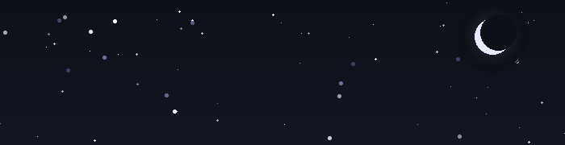
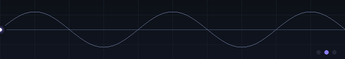

# V S KIRAN

Electronics & Instrumentation Engineering Student

*somewhere between circuits and code.*

 

 

---

## Things I Use

`C` &nbsp;·&nbsp; `C++` &nbsp;·&nbsp; `Python` &nbsp;·&nbsp; `HTML` &nbsp;·&nbsp; `CSS` &nbsp;·&nbsp; `JavaScript`

`React` &nbsp;·&nbsp; `Next.js` &nbsp;·&nbsp; `Node.js` &nbsp;·&nbsp; `Git` &nbsp;·&nbsp; `GitHub`

 

 

---

## Find Me

[LinkedIn](https://www.linkedin.com/in/vs-kiran-16b178394/) &nbsp;·&nbsp; [GitHub](https://github.com/Kiran8112006) &nbsp;·&nbsp; [Email](mailto:vskiran53@gmail.com)

 

---

## activity

<picture>
  <source media="(prefers-color-scheme: dark)" srcset="https://raw.githubusercontent.com/Kiran8112006/Kiran8112006/output/github-snake-dark.svg" />
  <source media="(prefers-color-scheme: light)" srcset="https://raw.githubusercontent.com/Kiran8112006/Kiran8112006/output/github-snake.svg" />
  
</picture>

 

*still building.*
