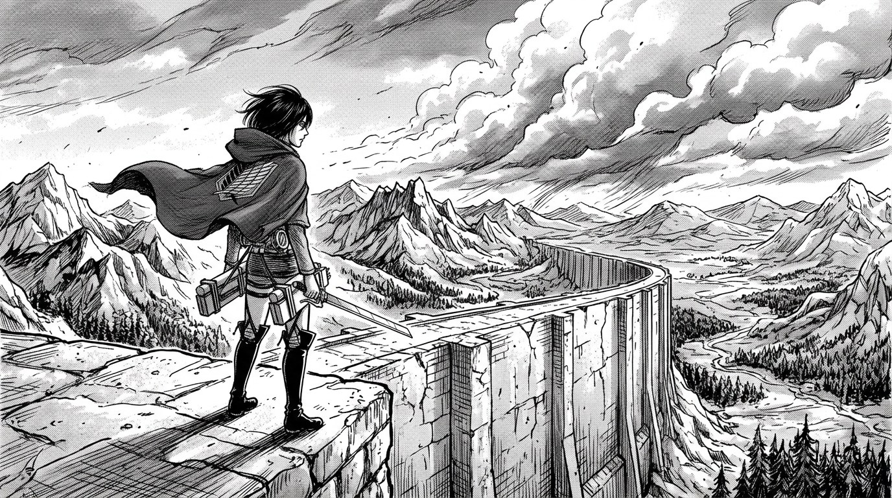

# V S KIRAN

### E&amp;I ENGINEERING STUDENT

`software` &nbsp;·&nbsp; `electronics` &nbsp;·&nbsp; `ML` &nbsp;·&nbsp; `VLSI`

building things and figuring out why they work.

 

[LinkedIn](https://www.linkedin.com/in/vs-kiran-16b178394/) &nbsp;•&nbsp; [GitHub](https://github.com/Kiran8112006) &nbsp;•&nbsp; Bangalore Institute of Technology

  

  

### about

I'm an Electronics &amp; Instrumentation Engineering undergraduate at Bangalore Institute of Technology (2024–2028, CGPA: 9.14).

I spend most of my time around the boundary where circuits meet software. I'm drawn to physical sensors, analog signal conditioning, and low-level digital logic, but I also build full-stack web applications and backend telemetry pipelines. Lately, that interest has been pulling me toward VLSI and semiconductor technology.

When I'm not studying or coding, I'm usually reading dark manga, following mystery thrillers, or building things late at night.

  

  

 

### projects

**RoadSOS**  
A sensor-driven accident detection and emergency response system. It monitors real-time accelerometer and gyroscope streams from mobile telemetry, uses pattern recognition to flag sudden impact anomalies, and coordinates emergency alerts with live location data.  
*Python, C++, JavaScript, Node.js*

 

**GridSenti**  
An exploratory telemetry pipeline targeting high-impedance faults on electrical distribution lines—abnormal faults that draw too little current to trip standard threshold breakers but pose severe hazards. Combines continuous electrical telemetry with rule-based heuristics and ML fault classification.  
*Python, C, C++*

 

**HireLoop**  
A campus recruitment platform built to replace fragmented spreadsheets and scattered drives. Synchronizes student portfolios and live application states, recruiter drive schedules and evaluation rubrics, and placement coordinator audit workflows in one place.  
*React, Next.js, Node.js, JavaScript, HTML, CSS*

  

  

### reva hackathon

Runner-Up at the REVA Hackathon.

48 hours of rapid prototyping, sensor telemetry calibration, and fixing race conditions minutes before the demo. One of those weekends where sleep becomes optional and you find out what you can actually build under pressure.

  

  

### vlsi & the silicon arc

Still very much in the learning arc.

Going beneath the software abstraction layer into raw hardware:
- Digital system design and synchronous state machines in **Verilog HDL**
- **Semiconductor physics**, CMOS logic gates, setup and hold timing, propagation delays
- Interfacing analog sensor conditioning circuits with digital logic

No claims of mastery—just genuine fascination with what happens at the transistor level.

  

  

### mental notes

A few quiet things I keep in mind when working on hard problems:

- Observe before assuming. When a circuit or a program fails, look at the raw signal first.
- Understand the system before trying to fix it.
- Look for the pattern before chasing the answer.
- Hardware keeps you honest—physics doesn't care about your intentions.
- The best systems feel quiet and simple.

  

### loadout

Tools and languages I actively use:

`C` &nbsp;·&nbsp; `C++` &nbsp;·&nbsp; `Python` &nbsp;·&nbsp; `JavaScript` &nbsp;·&nbsp; `React` &nbsp;·&nbsp; `Next.js` &nbsp;·&nbsp; `Node.js` &nbsp;·&nbsp; `HTML` &nbsp;·&nbsp; `CSS` &nbsp;·&nbsp; `Git` &nbsp;·&nbsp; `GitHub`

  

### activity

<picture>
  <source media="(prefers-color-scheme: dark)" srcset="https://raw.githubusercontent.com/Kiran8112006/Kiran8112006/output/github-snake-dark.svg" />
  <source media="(prefers-color-scheme: light)" srcset="https://raw.githubusercontent.com/Kiran8112006/Kiran8112006/output/github-snake.svg" />
  
</picture>

  

still learning. still building. occasionally breaking everything.

